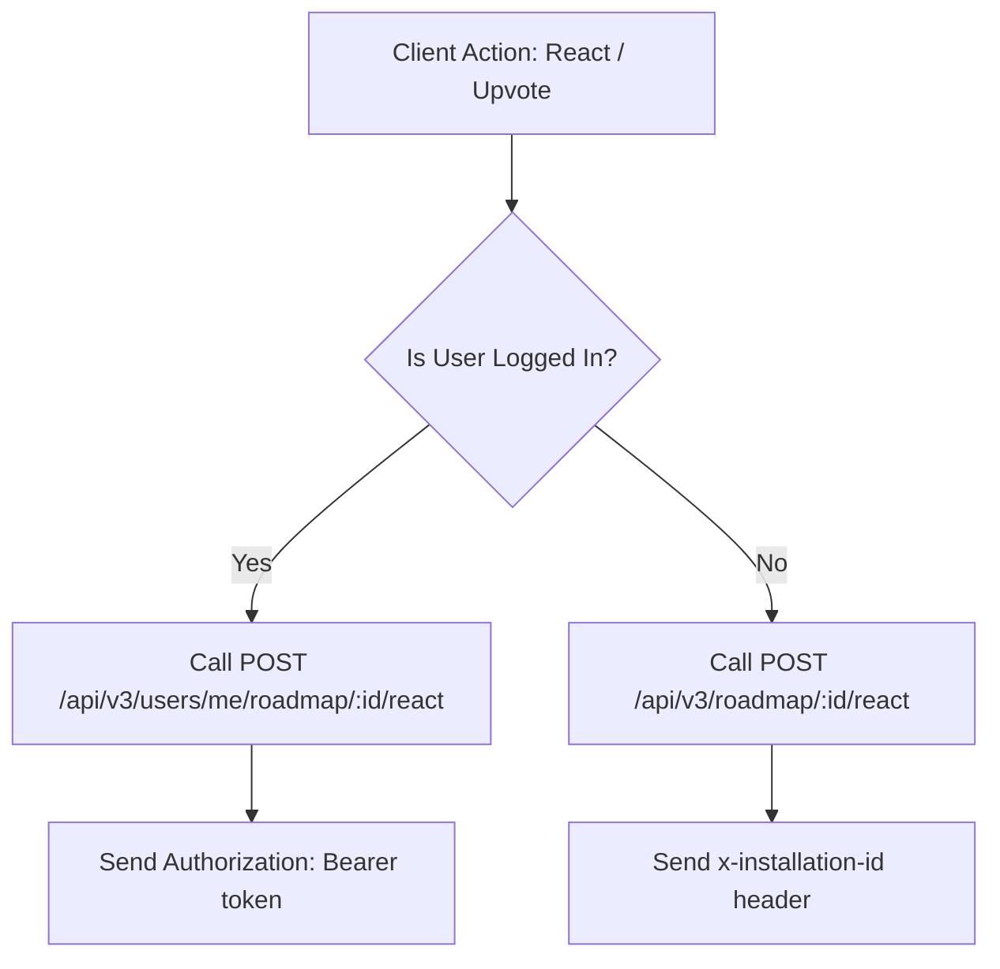

# Roadmap & Feature Suggestions API (v3)

The Roadmap API allows client applications (browser extensions, web apps, mobile apps, marketing site) to showcase upcoming features and fixes, enable users to react/upvote items, and submit their own ideas and suggestions.

---

## Endpoint Summary Matrix

| Scope | Method | Path | Auth / Identity Required | Purpose |
|---|---|---|---|---|
| **Public** | `GET` | `/api/v3/roadmap` | None *(Optional: Auth / `x-installation-id`)* | List published roadmap items with personalized reaction state |
| **Public** | `GET` | `/api/v3/roadmap/:id` | None *(Optional: Auth / `x-installation-id`)* | Get details of a single published roadmap item |
| **Public** | `POST` | `/api/v3/roadmap/suggestions` | None *(Optional: `x-installation-id`)* | Submit an anonymous community suggestion |
| **Public (Anonymous)** | `POST` | `/api/v3/roadmap/:id/react` | `x-installation-id` | Anonymous/Extension upvote or reaction |
| **Public (Anonymous)** | `DELETE` | `/api/v3/roadmap/:id/react` | `x-installation-id` | Remove anonymous upvote or reaction |
| **User (`users/me`)** | `GET` | `/api/v3/users/me/roadmap` | `Authorization: Bearer <token>` | List all roadmap items submitted by logged-in user |
| **User (`users/me`)** | `POST` | `/api/v3/users/me/roadmap` | `Authorization: Bearer <token>` | Submit new suggestion as logged-in user (auto-upvoted) |
| **User (`users/me`)** | `GET` | `/api/v3/users/me/roadmap/:id` | `Authorization: Bearer <token>` | Get user's own submitted suggestion |
| **User (`users/me`)** | `PATCH` | `/api/v3/users/me/roadmap/:id` | `Authorization: Bearer <token>` | Edit user's own suggestion (`title`, `description`, `type`) |
| **User (`users/me`)** | `DELETE` | `/api/v3/users/me/roadmap/:id` | `Authorization: Bearer <token>` | Delete / withdraw user's own suggestion |
| **User (`users/me`)** | `POST` | `/api/v3/users/me/roadmap/:id/react` | `Authorization: Bearer <token>` | Add/toggle reaction as authenticated user |
| **User (`users/me`)** | `DELETE` | `/api/v3/users/me/roadmap/:id/react` | `Authorization: Bearer <token>` | Remove reaction as authenticated user |
| **Admin** | `GET` | `/api/v3/admin/roadmap` | `x-admin-api-key` | List all roadmap items (including drafts/internal) |
| **Admin** | `POST` | `/api/v3/admin/roadmap` | `x-admin-api-key` | Create official roadmap item |
| **Admin** | `PATCH` | `/api/v3/admin/roadmap/:id` | `x-admin-api-key` | Update status, lifecycle stage, version, or promote |
| **Admin** | `DELETE` | `/api/v3/admin/roadmap/:id` | `x-admin-api-key` | Permanently delete roadmap item |

---

## Architecture & Lifecycle

### Item Types
- `feature`: New features or major capabilities.
- `fix`: Bug fixes, reliability improvements, or performance patches.
- `improvement`: Enhancements to existing features.

### Lifecycle Statuses
- `under_review`: Community suggestions or ideas awaiting team assessment.
- `considering`: Under active evaluation and feasibility study by the team before planning.
- `planned`: Accepted and queued for upcoming development.
- `in_progress`: Actively being engineered.
- `completed`: Shipped and available in production.
- `closed`: Declined, archived, or duplicate.

### Attribution Sources
- `community` *(default)*: Suggestion submitted by community users or extension clients.
- `official`: Official roadmap item curated and planned by the core team.

---

## Authentication & Headers Guide

### 1. Anonymous / Extension Clients
Anonymous clients identify themselves via their unique installation UUID.
- **Header**: `x-installation-id: <uuid>` or `x-client-installation-id: <uuid>`
- **Use Case**: Anonymous voting on `/api/v3/roadmap/:id/react` and retrieving personalized `hasVoted` state in `/api/v3/roadmap`.

### 2. Authenticated Users
Logged-in users use standard Supabase Auth JWT tokens.
- **Header**: `Authorization: Bearer <token>`
- **Use Case**: Managing submitted suggestions (`/api/v3/users/me/roadmap/*`) and user-scoped reactions (`/api/v3/users/me/roadmap/:id/react`).

### 3. Admin Dashboard
- **Header**: `x-admin-api-key: <ADMIN_API_KEY>` or admin session cookie.

---

## Client Integration Decision Flow



---

## Public Scope API (`/api/v3/roadmap`)

### 1. List Roadmap Items
**`GET /api/v3/roadmap`**

Retrieve published roadmap items with filtering, search, sorting, and personalized reaction states.

#### Query Parameters
| Parameter | Type | Default | Description |
|---|---|---|---|
| `status` | `string` | optional | Filter by status or comma-separated list (e.g. `planned,in_progress,completed`) |
| `type` | `string` | optional | Filter by item type: `feature`, `fix`, `improvement` |
| `source` | `string` | optional | Filter by source: `community`, `official` |
| `search` | `string` | optional | Text search across title and description |
| `sort` | `string` | `votes` | Sort order: `votes` (default: pinned first, highest votes, newest) or `recent` (newest first) |
| `page` | `integer` | `1` | Page number |
| `limit` | `integer` | `20` | Items per page (max: 100) |
| `installationId` | `string` | optional | Installation ID fallback if not passing `x-installation-id` header |

#### Example Request
```http
GET /api/v3/roadmap?status=in_progress,planned&sort=votes HTTP/1.1
Host: api.tabsome.com
x-installation-id: 74d812e9-4e6f-40be-8422-921a221f7c00
```

#### Example Response (`200 OK`)
```json
{
  "success": true,
  "data": [
    {
      "id": "a4d31484-9dbb-4fc4-bb9e-bfec4fe03fa4",
      "title": "Cloud Sync for Custom Themes",
      "description": "Automatically sync wallpaper palettes and custom themes across multiple browsers.",
      "type": "feature",
      "status": "in_progress",
      "source": "official",
      "targetVersion": "v2.2.0",
      "tags": ["sync", "themes", "ui"],
      "voteCount": 42,
      "reactionsCount": {
        "upvote": 42,
        "fire": 12
      },
      "userId": null,
      "installationId": null,
      "authorName": "TabSome Team",
      "authorEmail": null,
      "isPublished": true,
      "isPinned": true,
      "metadata": {},
      "createdAt": "2026-08-20T10:00:00Z",
      "updatedAt": "2026-08-20T12:00:00Z",
      "hasVoted": true,
      "userReaction": "upvote"
    }
  ],
  "pagination": {
    "total": 1,
    "page": 1,
    "limit": 20,
    "totalPages": 1,
    "hasNextPage": false,
    "hasPrevPage": false
  }
}
```

---

### 2. Get Single Roadmap Item
**`GET /api/v3/roadmap/:id`**

Retrieve details for a single published roadmap item.

#### Example Request
```http
GET /api/v3/roadmap/a4d31484-9dbb-4fc4-bb9e-bfec4fe03fa4 HTTP/1.1
Host: api.tabsome.com
x-installation-id: 74d812e9-4e6f-40be-8422-921a221f7c00
```

#### Example Response (`200 OK`)
```json
{
  "success": true,
  "data": {
    "id": "a4d31484-9dbb-4fc4-bb9e-bfec4fe03fa4",
    "title": "Cloud Sync for Custom Themes",
    "description": "Automatically sync wallpaper palettes and custom themes across multiple browsers.",
    "type": "feature",
    "status": "in_progress",
    "source": "official",
    "targetVersion": "v2.2.0",
    "tags": ["sync", "themes"],
    "voteCount": 42,
    "reactionsCount": {
      "upvote": 42
    },
    "isPublished": true,
    "isPinned": false,
    "hasVoted": true,
    "userReaction": "upvote",
    "createdAt": "2026-08-20T10:00:00Z",
    "updatedAt": "2026-08-20T12:00:00Z"
  }
}
```

---

### 3. Submit Suggestion / Feature Request (Public / Anonymous)
**`POST /api/v3/roadmap/suggestions`**

Allows anonymous or public users to submit a new feature request or fix idea. Submissions automatically start in `under_review` status.

#### Request Body
```json
{
  "title": "Add keyboard shortcuts for fast folder switching",
  "description": "It would be great to jump between folders using Alt+1, Alt+2.",
  "type": "feature",
  "authorName": "Alex",
  "authorEmail": "alex@example.com",
  "installationId": "74d812e9-4e6f-40be-8422-921a221f7c00",
  "metadata": {
    "source": "extension_popup"
  }
}
```

#### Example Response (`201 Created`)
```json
{
  "success": true,
  "data": {
    "id": "55c48b11-d0e5-4d04-8b64-00e95ff92a18",
    "title": "Add keyboard shortcuts for fast folder switching",
    "description": "It would be great to jump between folders using Alt+1, Alt+2.",
    "type": "feature",
    "status": "under_review",
    "source": "community",
    "voteCount": 1,
    "reactionsCount": {
      "upvote": 1
    },
    "isPublished": false,
    "hasVoted": true,
    "userReaction": "upvote",
    "createdAt": "2026-08-20T17:15:00Z",
    "updatedAt": "2026-08-20T17:15:00Z"
  },
  "message": "Suggestion submitted successfully"
}
```

---

### 4. React / Upvote an Item (Anonymous Scope)
**`POST /api/v3/roadmap/:id/react`**

Add an upvote or reaction to a roadmap item as an anonymous user via `installationId`.

#### Headers / Body
- **Header**: `x-installation-id: <uuid>` (or `x-client-installation-id: <uuid>`)
- **Body**:
```json
{
  "reactionType": "upvote",
  "installationId": "74d812e9-4e6f-40be-8422-921a221f7c00"
}
```

#### Example Response (`200 OK`)
```json
{
  "success": true,
  "data": {
    "itemId": "55c48b11-d0e5-4d04-8b64-00e95ff92a18",
    "reactionType": "upvote",
    "hasVoted": true,
    "userReaction": "upvote",
    "voteCount": 2,
    "reactionsCount": {
      "upvote": 2
    }
  }
}
```

---

### 5. Remove Upvote / Reaction (Anonymous Scope)
**`DELETE /api/v3/roadmap/:id/react`**

Remove the anonymous installation's upvote or reaction.

#### Headers / Query Parameters
- **Header**: `x-installation-id: <uuid>`
- **Query Parameters**:
  - `reactionType`: Type of reaction to delete (default: `upvote`)
  - `installationId`: Optional fallback query param if header not sent.

#### Example Response (`200 OK`)
```json
{
  "success": true,
  "data": {
    "itemId": "55c48b11-d0e5-4d04-8b64-00e95ff92a18",
    "reactionType": "upvote",
    "hasVoted": false,
    "userReaction": null,
    "voteCount": 1,
    "reactionsCount": {
      "upvote": 1
    }
  }
}
```

---

## User Scope API (`/api/v3/users/me/roadmap`)

All endpoints in this section require an authenticated user session (`Authorization: Bearer <token>`).

### 1. List User's Submitted Roadmap Items
**`GET /api/v3/users/me/roadmap`**

Fetches all roadmap items submitted by the authenticated user (including items in `under_review`, `considering`, `planned`, etc.).

#### Query Parameters
| Parameter | Type | Default | Description |
|---|---|---|---|
| `status` | `string` | optional | Filter by status or comma-separated list |
| `type` | `string` | optional | Filter by item type: `feature`, `fix`, `improvement` |
| `search` | `string` | optional | Text search across title and description |
| `sort` | `string` | `newest` | Sort order: `newest`, `oldest`, `votes`, `updated` |

---

### 2. Create Roadmap Suggestion (Authenticated User)
**`POST /api/v3/users/me/roadmap`**

Submit a new suggestion as the logged-in user. Automatically sets `user_id = user.id`, initial status `under_review`, `source: 'community'`, and records the author's upvote reaction.

#### Headers
- `Authorization: Bearer <token>`

#### Request Body
```json
{
  "title": "Sync bookmarks with Notion database",
  "description": "Allow one-click export of bookmarks directly into a Notion workspace table.",
  "type": "feature",
  "metadata": {}
}
```

#### Example Response (`201 Created`)
```json
{
  "success": true,
  "data": {
    "id": "e4a7a40b-7128-4444-93fe-789a4cd0f9a2",
    "title": "Sync bookmarks with Notion database",
    "description": "Allow one-click export of bookmarks directly into a Notion workspace table.",
    "type": "feature",
    "status": "under_review",
    "source": "community",
    "targetVersion": null,
    "tags": [],
    "voteCount": 1,
    "reactionsCount": {
      "upvote": 1
    },
    "userId": "d747cfcf-eb0d-45fc-9a1c-ec5272a243fa",
    "installationId": null,
    "authorName": "Jane Doe",
    "authorEmail": "jane@example.com",
    "isPublished": false,
    "isPinned": false,
    "metadata": {},
    "createdAt": "2026-08-23T08:00:00Z",
    "updatedAt": "2026-08-23T08:00:00Z",
    "hasVoted": true,
    "userReaction": "upvote"
  },
  "message": "Roadmap item created successfully"
}
```

---

### 3. Get User's Roadmap Item
**`GET /api/v3/users/me/roadmap/:id`**

Fetches a specific roadmap suggestion submitted by the authenticated user.

#### Headers
- `Authorization: Bearer <token>`

---

### 4. Edit User's Roadmap Item
**`PATCH /api/v3/users/me/roadmap/:id`**

Allows the author to edit their roadmap suggestion (`title`, `description`, `type`, `metadata`).

#### Headers
- `Authorization: Bearer <token>`

#### Request Body
```json
{
  "title": "Sync bookmarks with Notion database & Obsidian",
  "description": "Allow export of bookmarks directly into Notion or Obsidian vaults.",
  "type": "feature"
}
```

---

### 5. Delete User's Roadmap Item
**`DELETE /api/v3/users/me/roadmap/:id`**

Allows the author to withdraw and delete their suggestion and its associated reactions.

#### Headers
- `Authorization: Bearer <token>`

---

### 6. React / Upvote an Item (Authenticated User)
**`POST /api/v3/users/me/roadmap/:id/react`**

Allows an authenticated user to react to or upvote any roadmap item.

#### Headers
- `Authorization: Bearer <token>`

#### Request Body
```json
{
  "reactionType": "upvote"
}
```

#### Example Response (`200 OK`)
```json
{
  "success": true,
  "data": {
    "itemId": "55c48b11-d0e5-4d04-8b64-00e95ff92a18",
    "reactionType": "upvote",
    "hasVoted": true,
    "userReaction": "upvote",
    "voteCount": 15,
    "reactionsCount": {
      "upvote": 15
    }
  }
}
```

---

### 7. Remove Upvote / Reaction (Authenticated User)
**`DELETE /api/v3/users/me/roadmap/:id/react`**

Allows an authenticated user to remove their upvote or reaction from a roadmap item.

#### Headers
- `Authorization: Bearer <token>`

#### Query Parameters
- `reactionType`: Type of reaction to delete (default: `upvote`)

#### Example Response (`200 OK`)
```json
{
  "success": true,
  "data": {
    "itemId": "55c48b11-d0e5-4d04-8b64-00e95ff92a18",
    "reactionType": "upvote",
    "hasVoted": false,
    "userReaction": null,
    "voteCount": 14,
    "reactionsCount": {
      "upvote": 14
    }
  }
}
```

---

## Admin API Endpoints (`/api/v3/admin/roadmap`)

All admin endpoints require `x-admin-api-key: <ADMIN_API_KEY>` or admin session cookie.

### 1. List All Roadmap Items
**`GET /api/v3/admin/roadmap`**
- Query parameters: `search`, `status`, `type`, `source`, `isPublished`, `isPinned`, `page`, `limit`.
- Returns all items including draft/unpublished and community suggestions.

### 2. Create Official Item
**`POST /api/v3/admin/roadmap`**

```json
{
  "title": "Biometric Authentication Lock",
  "description": "Unlock sensitive bookmarks using TouchID / Windows Hello.",
  "type": "feature",
  "status": "planned",
  "source": "official",
  "targetVersion": "v2.3",
  "tags": ["security", "auth"],
  "isPublished": true,
  "isPinned": false
}
```

### 3. Update Roadmap Item
**`PATCH /api/v3/admin/roadmap/:id`**

Promote community suggestions, update status to `in_progress` or `completed`, change target release versions, or toggle visibility.

```json
{
  "status": "in_progress",
  "source": "official",
  "targetVersion": "v2.2.0",
  "isPinned": true
}
```

### 4. Delete Roadmap Item
**`DELETE /api/v3/admin/roadmap/:id`**

Permanently deletes the roadmap item and cascades removal of associated reactions.

---

## TypeScript Client Interfaces

```typescript
export type RoadmapItemType = 'feature' | 'fix' | 'improvement';

export type RoadmapItemStatus =
  | 'under_review'
  | 'considering'
  | 'planned'
  | 'in_progress'
  | 'completed'
  | 'closed';

export type RoadmapItemSource = 'community' | 'official';

export interface RoadmapItem {
  id: string;
  title: string;
  description: string | null;
  type: RoadmapItemType;
  status: RoadmapItemStatus;
  source: RoadmapItemSource;
  targetVersion: string | null;
  tags: string[];
  voteCount: number;
  reactionsCount: Record<string, number>;
  userId?: string | null;
  installationId?: string | null;
  authorName?: string | null;
  authorEmail?: string | null;
  isPublished: boolean;
  isPinned: boolean;
  metadata?: Record<string, any>;
  createdAt: string;
  updatedAt: string;
  hasVoted?: boolean;
  userReaction?: string | null;
}

export interface RoadmapReactionResponse {
  itemId: string;
  reactionType: string;
  hasVoted: boolean;
  userReaction: string | null;
  voteCount: number;
  reactionsCount: Record<string, number>;
}
```

---

## Error Codes & Troubleshooting

| HTTP Status | Error Code | Description | Solution |
|---|---|---|---|
| `400` | `missing_installation_id` | Missing `x-installation-id` on public reactions | Pass `x-installation-id` header or body parameter |
| `400` | `invalid_id` | Invalid UUID format in URL path | Ensure valid UUID v4 string |
| `400` | `missing_title` | Missing title during submission | Provide non-empty string under 255 chars |
| `401` | `unauthorized` | Missing or invalid Bearer token on user scope | Send valid `Authorization: Bearer <token>` header |
| `403` | `forbidden` | Missing or invalid `x-admin-api-key` | Provide valid admin credentials |
| `404` | `not_found` | Roadmap item does not exist | Verify the requested item ID |
| `500` | `internal_server_error` | Server error during database transaction | Check server logs and retry |
